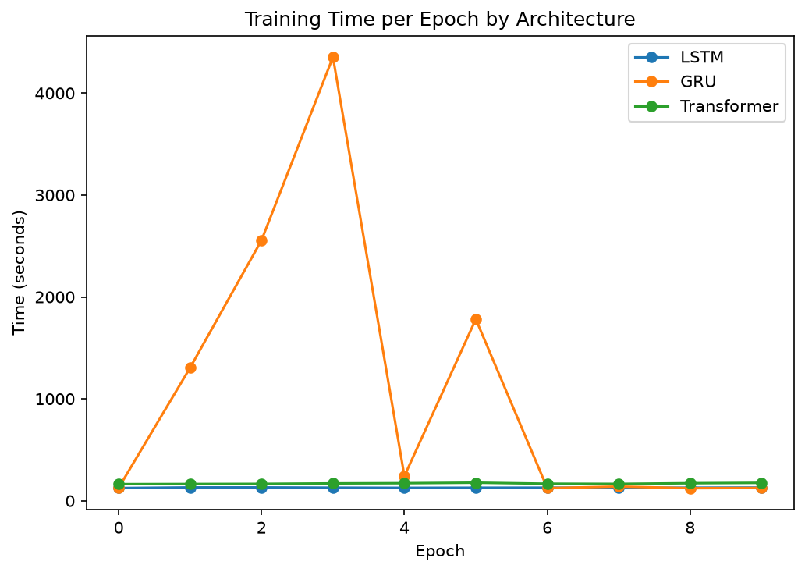
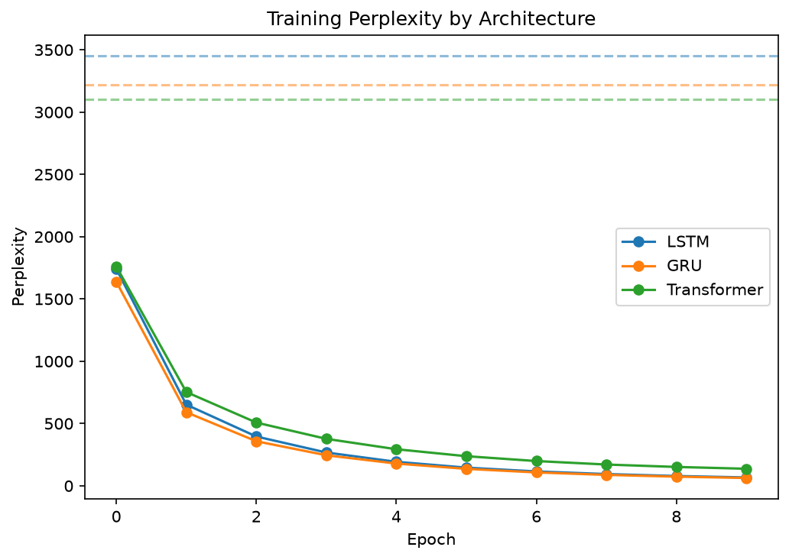
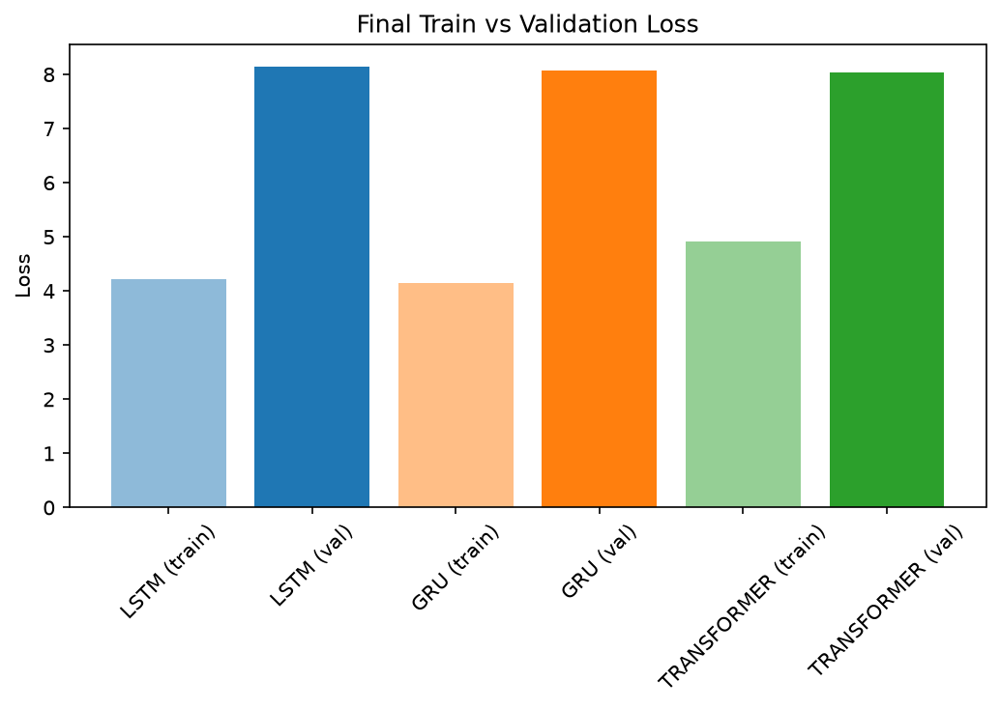
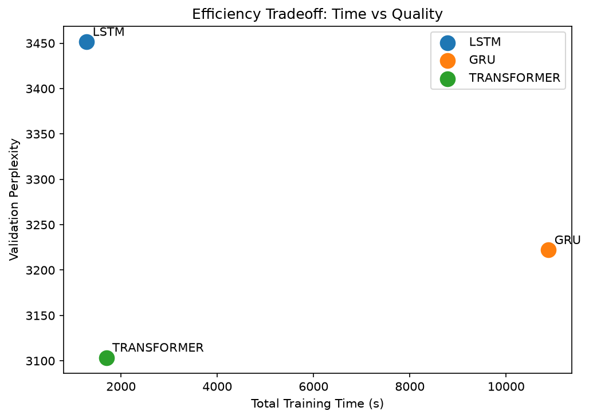
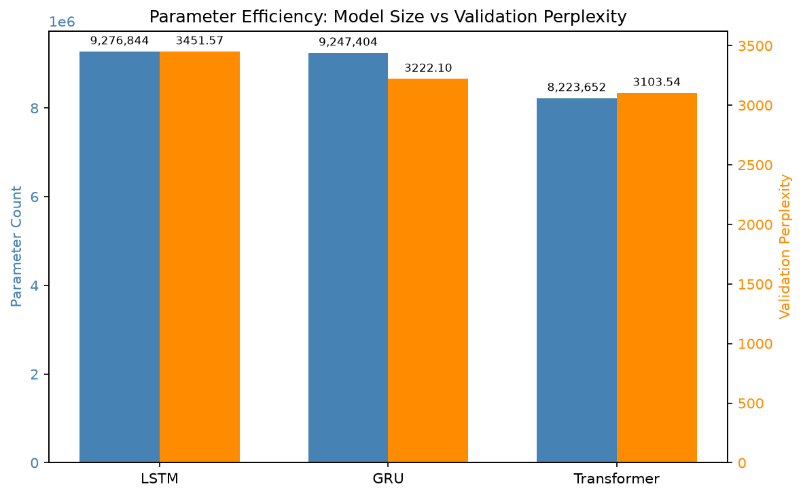
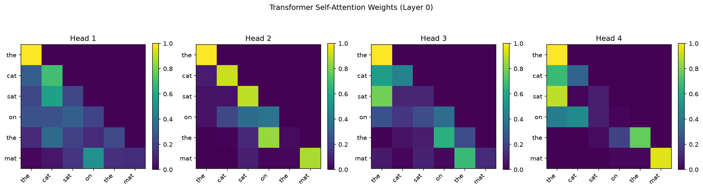

# Problem

Does architectural inductive bias (recurrence vs. attention) matter more than parameter count for language modeling on WikiText-2, and how does that tradeoff shift with training budget?

# Dataset

WikiText-2 (raw), loaded via Hugging Face `datasets` (`Salesforce/wikitext`, `wikitext-2-raw-v1`), using the official train/validation/test split.

To match the scale of the reference implementation and stay within a practical training budget, sentences were subsampled to `num_sentences=25000` rather than using the full corpus. This choice is discussed in detail under Debugging Notes, since it materially affected generation quality.

| Split      | Sentences used | Input sequences (seq_len=6) |
| ---------- | -------------- | --------------------------- |
| Train      | 25,000         | 560,625                     |
| Validation | 5,000          | derivable                   |
| Test       | none           | --                          |

Vocabulary size: 39,996 unique word-level tokens (n_vocab), including <pad> and <unk> as the last two indices (39994, 39995).

# Methodology

**Tokenization**: word-level, matching the original WikiText-2 benchmark papers (Merity et al., 2016) for comparability. Punctuation-escape artifacts specific to the raw WikiText-2 format (`@-@`, `@.@`, `@,@`) are un-escaped during cleaning; markdown-style section headers (`= Title =`) and pre-existing
`<unk>` markers are stripped.

**Sequence construction**: a fixed-window next-word prediction setup (`seq_len=6`). Each sentence is broken into sliding windows of up to 5 preceding words predicting the 6th; windows shorter than 5 words are left-padded with `<pad>`.

**Vocabulary handling**: the vocabulary is built once from training data and reused unchanged for validation and test encoding. Words unseen in training map to `<unk>` at eval/generation time rather than raising an error, so val/test perplexity reflects genuine held-out performance, not vocabulary
leakage.

**Training**: Adam optimizer, shared learning rate (1e-3) and batch size (200) across all three architectures, gradient clipping (max norm 0.5), 10 epochs. `<pad>` positions are excluded from the loss via `CrossEntropyLoss(ignore_index=pad_idx)`.

# Architecture comparison

|                           | LSTM                              | GRU              | Transformer                             |
| ------------------------- | --------------------------------- | ---------------- | --------------------------------------- |
| Recurrence                | Yes (2 states: h, c)              | Yes (1 state: h) | No (self-attention)                     |
| Sequence order            | Implicit (via recurrence)         | Implicit         | Explicit (learned positional embedding) |
| Future-token leakage risk | None (sequential by construction) | None             | Prevented via causal mask               |
| Params (approx., matched) | ~9.28M                            | ~9.25M           | ~8.22M                                  |

All three share the same embedding dimension and hidden size where
architecturally comparable, sized to land within roughly the same parameter
count so comparisons reflect inductive bias rather than raw capacity.

# Results

GRU epoch times was highly inconsistent (likely due to background system load), while the transformer and LSTM trained at a stable ~165-177s/epoch, making cross-architecture time comparisons unreliable without controlling for this.

all three models converge to low train perplexity (LSTM 67, GRU 63, Transformer 137) far below their validation perplexity lines (~3000s), visually exposing the shared overfitting problem across architectures.

all three models show a large, similarly-sized gap between final train and validation loss, reinforcing that the overfitting is a property of the data setup (short context, overlapping windows) rather than any one architecture’s weakness.

since validation perplexity is nearly identical across models, this panel mainly shows a time-efficiency comparison, transformer converges to comparable generalization performance without a runtime advantage or penalty relative to LSTM/GRU here.

transformer achieves comparable validation perplexity to LSTM/GRU with a similar or smaller parameter count, but the real efficiency question, since all three overfit similarly, isn’t well resolved by this panel and needs to be read alongside the overfitting finding rather than as a standalone quality signal.

the causal mask is clearly visible as a lower-triangular pattern (each position only attends to itself and earlier tokens), confirming the model respects the intended autoregressive structure, distinct from what an LSTM/GRU comparison could show directly.

# Conclusion

All three architectures show a similar pattern: low train perplexity (LSTM 67, GRU 63, Transformer 137) but validation perplexity in the 3000s across all three. Since the gap is consistent across structurally different architectures, this points to the data setup rather than any one model's inductive bias: `seq_len=6` combined with 560,625 sliding-window training examples drawn from only 25,000 sentences produces highly overlapping local context, encouraging memorization of article-specific vocabulary (entity names, proper nouns) over generalizable structure. The transformer's generated text makes this most visible, with specific entities ("Unyanyembe," "Veronica," "map") repeating non-sequitur by epoch 10 (see Sample Generations below).

**Sample generations**

## Sample Generated Text (seed: "The")

| Model       | Generated Text                                                                                                                                                                                                                                                                                                                                                                                                                                                                                                                              |
| ----------- | ------------------------------------------------------------------------------------------------------------------------------------------------------------------------------------------------------------------------------------------------------------------------------------------------------------------------------------------------------------------------------------------------------------------------------------------------------------------------------------------------------------------------------------------- |
| LSTM        | The entire highway system in the region of a new badge in September 2006 and the second season premiere . was the only feature in late 1980s in June . ' was the monarch could have had the right side not the right to take control the first down with their sons the rear superstructure were bricked for the time and then to reduce to go ahead . as punk rock Department of a new badge but still loved in a short place during its time construction and was made by some Arkansans . and are known for their hardiness              |
|  |
| GRU         | The first down M 37 yard unsportsmanlike convoy were removed from a fire hydrant . while ' and ran to the south west coast of Parliament in 1937 by plate and the National Highway Museum of Mount Erebus and in the middle . who were theoretically in the middle . while it has been made in other cultures . and ' 80s ' . ' defense ' Apparatus in 2009 and the United Nations . who was a notoriously of the state of the state is to protect a product or the basis for a new point . 's ' side                                       |
| Transformer | The frock Unyanyembe numbering Unyanyembe for the freeway was named to have the first to begin and townships and townships with traffic volumes in 2015 to the pavement . River 's map and the state Veronica Giacomo and was completed . ' map and opened to pavement . Sea in 2004 's Michigan Foundation to the freeway and mobility and the state highway system . map for faking with Mac for faking and the state Veronica Mars . ' Shipyard . ' Veronica and the second phase . 's first and the United States for faking in 2015 's |

**Observation:** While all three models produce locally grammatical but globally incoherent
text (expected given seq_len=6 and 10 epochs on 25K sentences), the transformer's output
shows visibly more repetition of specific entities ("Unyanyembe," "Veronica," "map," "pavement")
compared to LSTM/GRU. This is consistent with the validation perplexity results below: all
three models show severe overfitting (train perplexity in the 60s-140s vs. validation
perplexity in the 3000s), but the transformer's generation quality makes that memorization
visually apparent in a way the aggregate perplexity number alone does not.

# Notes on training dynamics

### Dataset size and training convergence

`num_sentences` was reduced from the full corpus (2,416,048 input sequences) to 25,000 sentences (626,986 sequences), matching the scale of the reference tutorial implementation. This followed observing that training on the full dataset for a fixed 10 epochs produced generated text dominated by high-frequency utility words, with little content-word variety.

A preprocessing audit ruled out a data-cleaning bug as the cause: `<unk>` tokens were confirmed properly removed, and the word-frequency distribution matched the expected Zipfian pattern for English text. This pointed to insufficient training exposure relative to dataset size, rather than a data quality issue, so the dataset was scaled down to match the reference implementation's regime while holding epoch count and model capacity fixed. This let the models reach a more advanced stage of convergence within the same training budget, evidenced by more varied generated text from epoch 1
onward.

### Validation perplexity

Initial validation perplexity came back as extremely high (or `NaN`) for the transformer.
Two issues were identified and resolved:

**1. NaN from fully-masked attention rows.** When a sequence's first token was `<pad>`,
the combination of the causal mask (only self-attend at position 0) and the padding mask
(exclude `<pad>` as a valid key) left that query with zero valid attention targets,
producing `NaN` via softmax. Fixed by adding `torch.nan_to_num()` after the encoder output
in `TransformerModel.forward`.

**2. Ruling out `<unk>` tokens as the cause of high perplexity.** Validation targets were 6.3% `<unk>` tokens. At worst-case loss (~10.6, i.e. uniform over the 39,996-word vocab), this could only account for ~0.6-0.7 added average loss, far short of the observed train-to-val gap (loss ~4.2 to ~8.0), ruling this out as the primary cause.

### Limitations

- WikiText-2 is small (~2M training tokens); results may not generalize to the scale (100M+ tokens, billions of parameters) where Transformers are typically reported to dominate RNNs.
- Parameter-matching is approximate; architectures differ in compute characteristics (attention is quadratic in sequence length, recurrence is linear), so equal parameter count is not equal compute or memory footprint.
- A single learning rate was shared across architectures rather than tuned per model; a stricter ablation would search hyperparameters independently for each.

# Future work

- Tune learning rate and hidden size independently per architecture rather than sharing hyperparameters, to isolate inductive bias from under/over-tuning.
- Repeat training across multiple random seeds and report perplexity as mean ± std, since single-run numbers on a dataset this small are susceptible to noise.
- Extend the efficiency-vs-quality comparison (perplexity vs. cumulative training time) to directly test the research question: does the Transformer's advantage, if any, only emerge past a certain training budget?

# References

[1] Merity, S., Xiong, C., Bradbury, J., & Socher, R. (2016). _Pointer Sentinel Mixture Models._ (introduces WikiText-2)

[2] Vaswani, A., et al. (2017). _Attention Is All You Need._

[3] Hochreiter, S., & Schmidhuber, J. (1997). _Long Short-Term Memory._

[4] Cho, K., et al. (2014). _Learning Phrase Representations using RNN Encoder-Decoder for Statistical Machine Translation._ (introduces the GRU)

Reference implementation consulted for tutorial-scale hyperparameters:
https://www.kaggle.com/code/meowkhoa/text-generation-using-lstm-in-pytorch
